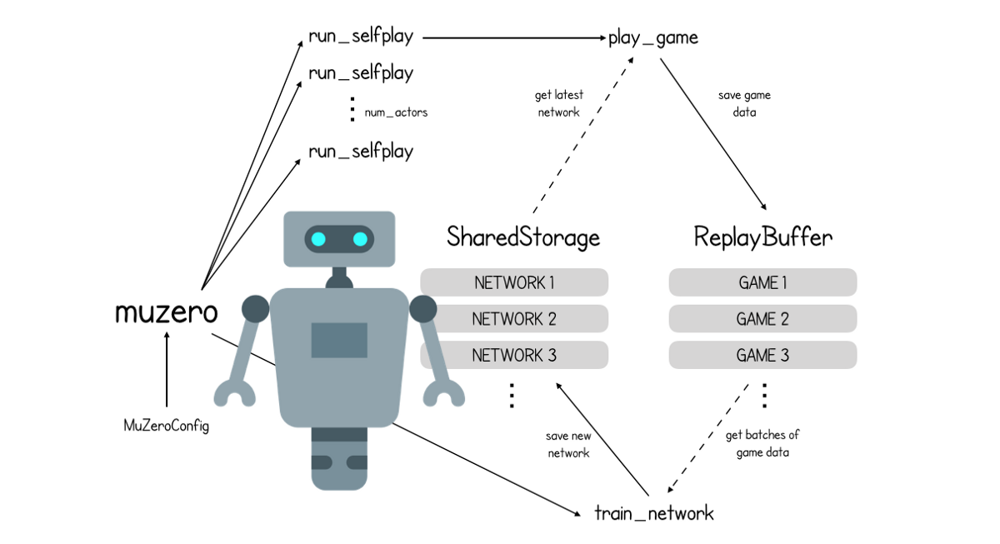

# Open-Zero
## Description

Open-zero is a research project aiming to realize the various projects of the company [DeepMind](https://github.com/deepmind):
- AlphaGo
- AlphaZero
- Muzero

We use Depth Reinforcemen Learning such as Actor-Crique or [A3C](https://paperswithcode.com/method/a3c)

To train our model we are using on diverse environments such as chess




## Installation

```
 git clone git@github.com:PoCInnovation/Open-Zero.git
 cd  Open-Zero
```
## Dependencies

|                          Dependency                        |      License       |
|:----------------------------------------------------------:|:------------------:|
| [pytorch/pytorch](https://github.com/pytorch/pytorch)              | [License](https://github.com/pytorch/pytorch/blob/master/LICENSE) |


------------
