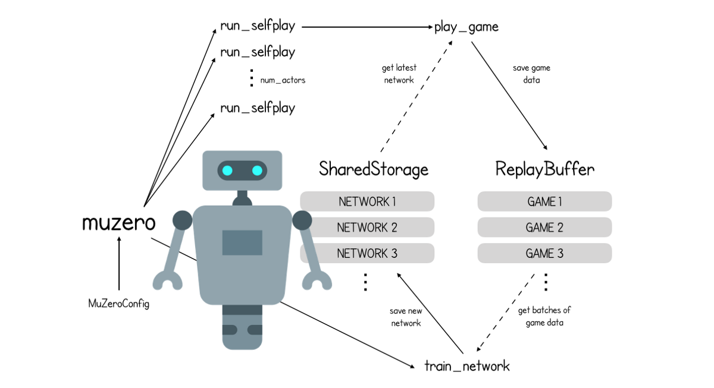
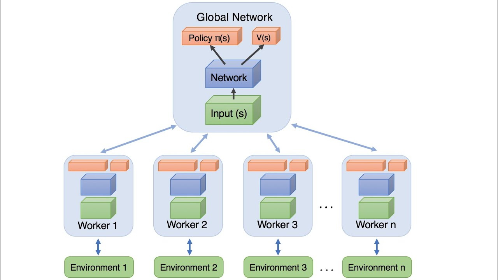

# Open-Zero

## Table of Content

[Introduction](#introduction)
[Features](#features)
[Installation](#installation)
[Quickstart](#quickstart)
[Contributors](#contributors)

------------
## Introduction

Open-Zero is a research project that aims to make open source implementation of [AlphaZero](https://deepmind.com/blog/article/alphazero-shedding-new-light-grand-games-chess-shogi-and-go) and [MuZero](https://deepmind.com/blog/article/muzero-mastering-go-chess-shogi-and-atari-without-rules) methods from [DeepMind](https://github.com/deepmind) on the game of chess.

We use Deep Reinforcement Learning methods such as Asynchronous Advantage Actor-Crique or [A3C](https://paperswithcode.com/method/a3c).



[A3C](https://paperswithcode.com/method/a3c) methods, unlike synchronous methods, use multithreading to get a larger amount of training data, making it faster to have promising result with the AI.

The AI instanciates as much workers as possible, each of these worker work on a copy of the global network. Once a worker has finished an episode of training, it updates the global network and starts a new episode with a copy of the latest global network. This method allows a faster training, but the wider variety of training data gives it a higher quality training and better result.



------------
## Features

### Training

The AI trains by playing against itself using [A3C](https://paperswithcode.com/method/a3c) methods.

### Testing

We can test the AI multiple ways:
- Watch the AI play against itself
- Make an evaluation of a game using Stockfish

------------
## Installation

### Clone Repository
```bash
git clone https://github.com/PoCInnovation/Open-Zero.git
cd Open-Zero
```

### Build and run the docker image
```bash
docker build . -t openzero
docker run -it openzero /bin/bash
```

------------
## Quickstart

The ```launch-project.sh``` script is the tool you use to do almost everything in this project.
Get the usage help by doing:
```bash

# should be launched inside of the docker image, because the tester expects
# the stockfish chess engine to be installed in /bins/stockfish
./launch-project.sh -h
```
------------
## Contributors

Gino Ambigaipalan → [Github](https://github.com/Tacos69)
Jean-Baptiste Debize → [Github](https://github.com/jeanbaptistedebize)
Nell Fauveau → [Github](https://github.com/Nellousan)
Bogdan Guillemoles → [Github](https://github.com/bogdzn)

------------
